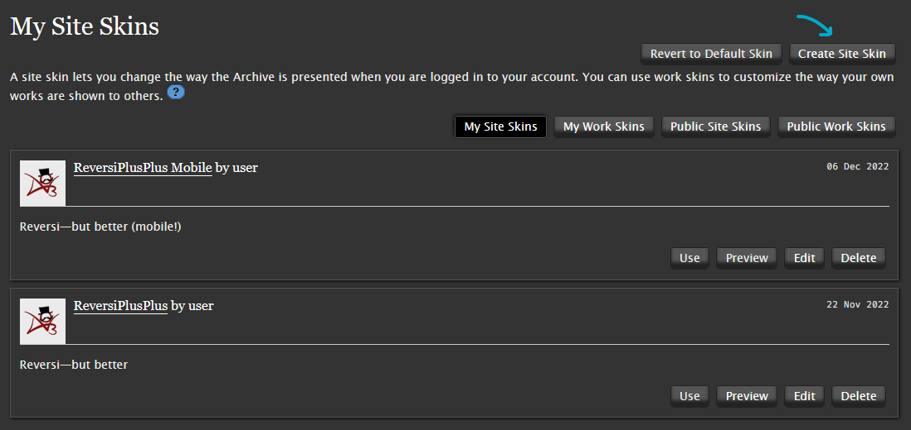

# ReversiPlusPlus
[Reversi](https://archiveofourown.org/skins/929) — but better. An Archive of Our Own “dark mode” reskin of Reversi with a focus on readability and less noise.

**This project is a work-in-progress.** Please bear with me while I find my style sheet legs.


## 1 Previews
| Reversi++                        | Reversi++ M                             |
| :------------------------------- | :-------------------------------------- |
|  |  |


## 2 Features
✅ **[Darker colours!](https://github.com/galaxygrotesque/ReversiPlusPlus#21-dark-mode-redux)**  
✅ **[Colourfully obvious tags trapped in a scroll box!](https://github.com/galaxygrotesque/ReversiPlusPlus#22-colour-coded-tags-that-pop)**  
✅ **[Dope fonts (if you’re willing to install them)!](https://github.com/galaxygrotesque/ReversiPlusPlus#23-custom-fonts)**


### 2.1 Dark mode redux
If you:
- hate reading on a stark white background
- hate reading on a *light* background
- prefer OLED themes or find some dark themes too bright
- have tired and/or light-sensitive eyes that suffer every time you step outside your carefully curated internet ~~cave~~ corner

Then ```ReversiPlusPlus``` might be your cup of tea!

Inspired by Mozilla Firefox’s dark colour scheme, ```ReversiPlusPlus```:
- Uses a darker colour palette that is easier on the eye
- Reduces visual noise by relying on colour/element contrast rather than borders and lines

|                    Ao3                    |                  Reversi                   | Reversi++ |
| :---------------------------------------: | :----------------------------------------: | :-------- |
|  |  |           |


### 2.2 Colour-coded tags that ✨pop✨
Tags are essential when trying to find stories you want to read, but they’re often lost in the noise.

With ```ReversiPlusPlus```, tags are colour-coded by category!
- **Red:** content warnings
- **Blue:** relationships
- **Green:** characters
- **Grey:** freeform tags

In the case of tag-heavy works, tags are also confined to a scroll box!
- Tags are confined to ~4 lines per work blurb
- If the number of tags exceeds ~4 lines in a particular blurb, the overflow will be trapped in scroll box jail

|             Ao3              |             Reversi              | Reversi++                                |
| :--------------------------: | :------------------------------: | :--------------------------------------- |
|  |  |  |


### 2.3 Custom fonts
- **Good news:** ```ReversiPlusPlus``` uses some common web-safe and system font alternatives in addition to Ao3’s default fonts!

- **Bad news:** Due to how Ao3 handles user skins and limits CSS, they can’t be automatically packaged with or built into the skin. (I went through a grieving process here. Trust me, I really wish they could.)

This means **if you want alternative fonts** to appear, you’ll have to **install them on your device** — PC, phone, tablet, or whatever else.

For your convenience, here is a handy table containing (most) of the fonts and where to find them.

| Serif                                                                                         |               | Sans-Serif                                                                     |               | Monospaced                                                                           |               |
| :-------------------------------------------------------------------------------------------- | :-----------: | :----------------------------------------------------------------------------- | :-----------: | :----------------------------------------------------------------------------------- | :-----------: |
| [Charter](https://fontesk.com/charter-typeface/)                                              | ```* @    ``` | [Helvetica Neue](https://myfonts.com/collections/neue-helvetica-font-linotype) | ```  @   $``` | [Fira Code](https://fonts.google.com/specimen/Fira+Code)                             | ```*      ``` |
| [IBM Plex Serif](https://fonts.google.com/specimen/IBM+Plex+Serif)                            | ```*      ``` | [IBM Plex Sans](https://fonts.google.com/specimen/IBM+Plex+Sans)               | ```*      ``` | [IBM Plex Mono](https://fonts.google.com/specimen/IBM+Plex+Mono)                     | ```*      ``` |
| [Libre Baskerville](https://fonts.google.com/specimen/Libre+Baskerville)                      | ```*      ``` | [Lato](https://fonts.google.com/specimen/Lato)                                 | ```*      ``` | [Menlo](https://github.com/hbin/top-programming-fonts/blob/master/Menlo-Regular.ttf) | ```* @    ``` |
| [Literata](https://fonts.google.com/specimen/Literata)                                        | ```*      ``` | [Noto Sans](https://fonts.google.com/specimen/Noto+Sans)                       | ```*      ``` | [Source Code Pro](https://fonts.google.com/specimen/Source+Code+Pro)                 | ```*      ``` |
| [Lora](https://fonts.google.com/specimen/Lora)                                                | ```*      ``` | [Proxima Nova](https://fonts.adobe.com/fonts/proxima-nova)                     | ```  @   $``` |                                                                                      |               |
| [Noto Serif](https://fonts.google.com/specimen/Noto+Serif)                                    | ```*      ``` | [Source Sans 3](https://fonts.google.com/specimen/Source+Sans+3)               | ```*      ``` |                                                                                      |               |
| [Palatino](https://myfonts.com/collections/palatino-font-linotype)                            | ```  @   $``` |                                                                                |               |                                                                                      |               |
| [Palatino Linotype](https://learn.microsoft.com/en-us/typography/font-list/palatino-linotype) | ```    #  ``` |                                                                                |               |                                                                                      |               |
| [Source Serif 4](https://fonts.google.com/specimen/Source+Serif+4)                            | ```*      ``` |                                                                                |               |                                                                                      |               |

```*``` − Web font (i.e., free!)  
```@``` − iOS/iPadOS system font  
```#``` − Windows Office cloud font  
```$``` − Paid


## 3 Road map
- [x] Mobile-specific ```RPP.css```
	- [ ] Refine ```RPPM.css```
- [ ] Vet and add support for more fonts
- [ ] Tidy code (read: figure out what I’m doing)
- [ ] Rewrite as fully-fledged stylesheet to replace rather than build off of Ao3’s core

### 3.1 Short-term to-do list
- [ ] adjust sort and filter sidebar to match work index group
- [x] figure out how to lower buttons/stats on work blurbs
- [ ] add more fonts into font lists 
- [ ] get rid of borders everywhere except for explicit elements
- [ ] different unicode arrow characters for mobile because apparently roboto doesn't like it
- [x] start setting up mobile values so creation of mobile ```RPPM.css``` is easier


## 4 Installation
```ReversiPlusPlus``` builds right off of Ao3’s existing stylesheet, so no extra add-ons or browser extensions required!

Installing is as simple as **creating a new site skin** for your user. All user site skins are private by default — no worries about accidentally making something public.

To create a new site skin:

1. Navigate to [Archive Of Our Own](https://archiveofourown.org/).

2. While logged in, go to your dashboard.

	


	
3. On the dashboard, select ```Skins```.

4. The Skins page will have multiple buttons. In the top right-hand corner, select ```Create Site Skin```.

	

5. Welcome to the Create New Site Skin page!
	
	

	Now fill in the following fields:

	1. The ```Type``` field must be set to ```Site Skin```.
	2. The ```Title``` field must have a value in it, and that value **must be unique** because Ao3 only distinguishes user site skins by name, not by user.
	3. The ```CSS``` field must have CSS in it — i.e., the text in [```ReversiPlusPlus.css```](https://github.com/galaxygrotesque/ReversiPlusPlus/blob/main/css/ReversiPlusPlus.css) or [```ReversiPlusPlus-Mobile.css```](https://github.com/galaxygrotesque/ReversiPlusPlus/blob/main/css/ReversiPlusPlus-Mobile.css). Copy + paste baybeeee ✨

	**Don’t submit just yet!**
	
	Need a couple extra things first — namely, the options hidden under this fun little ```Show ↓``` button under the giant CSS field.
	
	
	
	You’ll get a section that looks like this:
	
	
	
	Here, fill in the following fields:
	
	4. The ```What it does``` field must be set to ```add on to archive skin```.
	5. In the ```Media``` section under ```Choose @media```, the ```⬜ all``` option must be checked.

	All done?

6. Slap ```Submit```!

	

7. You’ll be taken to a new page with your site skin with a ```Skin was successfully created.``` message.

	Scroll aaaaall the way down to the bottom where you’ll see these four options:

	
	
	Hit ```Use```.

And voilà! There you have it. Skin installed. 🌠
