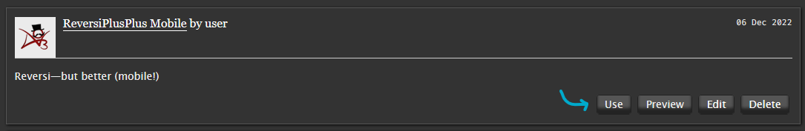

# ReversiPlusPlus
Reversi—but better. An Archive of Our Own “dark mode” reskin with a focus on readability and less noise.

**This project is a work-in-progress.** Please bear with me while I find my stylesheet legs.

## Table of contents
{{TOC}}

+++

## Screenshots
[To add]

+++

## Features
[More to add]

+++

### Fonts
**Good news:** ReversiPlusPlus uses some common web-safe font alternatives in addition to Ao3’s default fonts!

**Bad news:** Due to how Ao3 handles user skins and limits CSS, they can’t be automatically packaged with the skin. (I went through a grieving process here. Trust me, I really wish they could.)

This means **if you want alternative fonts** to appear, you’ll have to **install them on your device**—PC, phone, tablet, or whatever else.

For your convenience, here is a handy table containing (most) of the fonts and where to find them.

| Font                                                                                 |      |
| :----------------------------------------------------------------------------------- | :--- |
| [Charter](https://fontesk.com/charter-typeface/)                                     | \* @ |
| [Fira Code](https://fonts.google.com/specimen/Fira+Code)                             | \*   |
| [Helvetica Neue](https://www.myfonts.com/collections/neue-helvetica-font-linotype)   | @ $  |
| [IBM Plex Sans](https://fonts.google.com/specimen/IBM+Plex+Sans)                     | \*   |
| [IBM Plex Serif](https://fonts.google.com/specimen/IBM+Plex+Serif)                   | \*   |
| [Literata](https://fonts.google.com/specimen/Literata)                               | \*   |
| [Menlo](https://github.com/hbin/top-programming-fonts/blob/master/Menlo-Regular.ttf) | \* @ |
| [Noto sans](https://fonts.google.com/specimen/Noto+Sans)                             | \*   |
| [Palatino](https://www.myfonts.com/collections/palatino-font-linotype)               | @ $  |
| [Proxima Nova](https://fonts.adobe.com/fonts/proxima-nova)                           | @ $  |
| [Source Code Pro](https://fonts.google.com/specimen/Source+Code+Pro)                 | \*   |
| [Source Sans 3](https://fonts.google.com/specimen/Source+Sans+3)                     | \*   |
| [Source Serif 4](https://fonts.google.com/specimen/Source+Serif+4)                   | \*   |

\* : web font (or free!)  
@ : i(Pad)OS system font  
$ : paid (not free ... unless system font)

+++

## Installation
ReversiPlusPlus builds right off of Ao3’s existing stylesheet, so no extra add-ons or browser extensions are required!

Installing is as simple as creating a new site skin for your user. All user site skins are private by default—no worries about accidentally making something public.

To create a new site skin:

1. Navigate to [ArchiveOfOurOwn](https://archiveofourown.org/).

2. While logged in, go to your dashboard.

	

3. On the dashboard, select “**Skins**”.

	

4. The Skins page will have multiple buttons. In the top right-hand corner, select ”**Create Site Skin**”.

	

	Welcome to the Create New Site Skin page!
	
	

5. Fill in the following fields:

	1. The **Type** field must be set to “**Site Skin**”.
	2. The **Title** field must have a value in it, and that value must be unique because Ao3 only distinguishes user site skins by name, not by user.
	3. The **CSS** field must have CSS in it—i.e., the text in [```ReversiPlusPlus.css```](https://github.com/galaxygrotesque/ReversiPlusPlus/blob/main/css/ReversiPlusPlus.css). Copy-paste baybeeee ✨

	**Don’t submit just yet!**
	
	Need a couple extra things first—namely, the options hidden under this fun little “**Show ↓**” button guy under the giant CSS field:
	
	
	
	You’ll get a section that looks like this:
	
	
	
	Here, fill in the following fields:
	
	4. The **What it does:** field must be set to “**add on to archive skin**”.
	5. In the **Media** section, the “⬜ **all**” option must be checked.

	All done?

6. Slap **Submit**!

	

7. You’ll be taken to a new page with your site skin with a “**Skin was successfully created**” message. Scroll aaaaall the way down to the bottom where you’ll see these four options:

	
	
	Hit **Use**.

And voilà! Skin installed. 

+++

## Mobile
In the works! There will be a separate CSS file for a mobile skin soon.