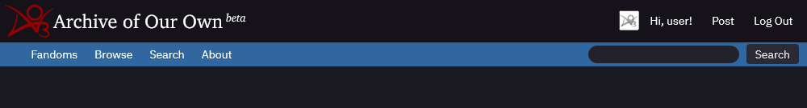

# ReversiPlusPlus
[Reversi](https://archiveofourown.org/skins/929) — but better. An Archive of Our Own “dark mode” reskin of Reversi with a focus on readability and less noise.

**This project is a work-in-progress.** Please bear with me while I find my style sheet legs.

|              Reversi++               |              Reversi++ Mobile               |
| :----------------------------------: | :-----------------------------------------: |
| 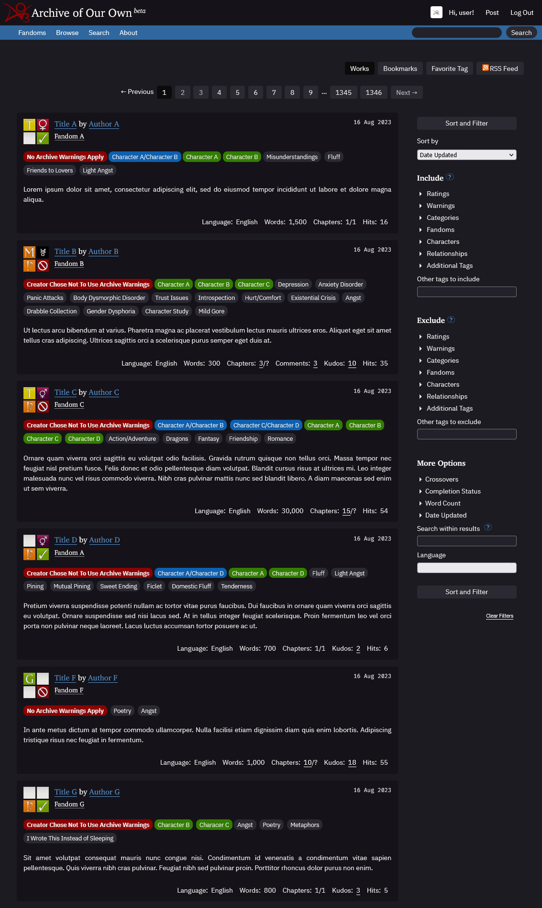 | 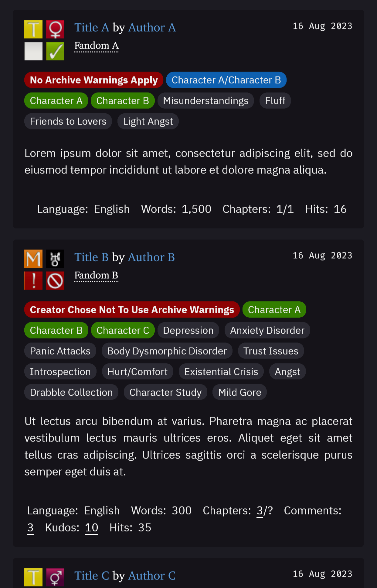 |


## 1  Features
✅ [Darker colours!](https://github.com/galaxygrotesque/ReversiPlusPlus#11dark-mode-redux)  
✅ [Colourfully obvious tags trapped in a scroll box!](https://github.com/galaxygrotesque/ReversiPlusPlus#12colour-coded-tags-that-pop)  
✅ [Cool fonts (if you’re willing to install them)!](https://github.com/galaxygrotesque/ReversiPlusPlus#13custom-fonts)


### 1.1  Dark mode redux
If you:
- hate reading on a stark white background
- hate reading on a *light* background
- prefer OLED themes or find some dark themes too bright
- have tired and/or light-sensitive eyes that suffer every time you step outside your carefully curated internet ~~cave~~ corner

Then ReversiPlusPlus might be your cup of tea!

Inspired by Mozilla Firefox’s dark colour scheme, ReversiPlusPlus:
- Uses a darker colour palette that is easier on the eye
- Reduces visual noise by relying on colour/element contrast rather than borders and lines

|                  Ao3                  |                Reversi                |                   Reversi++                   |
| :-----------------------------------: | :-----------------------------------: | :-------------------------------------------: |
| 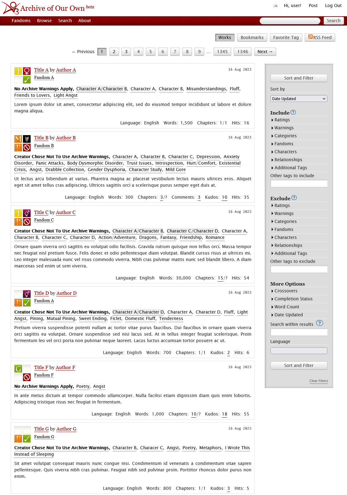 | 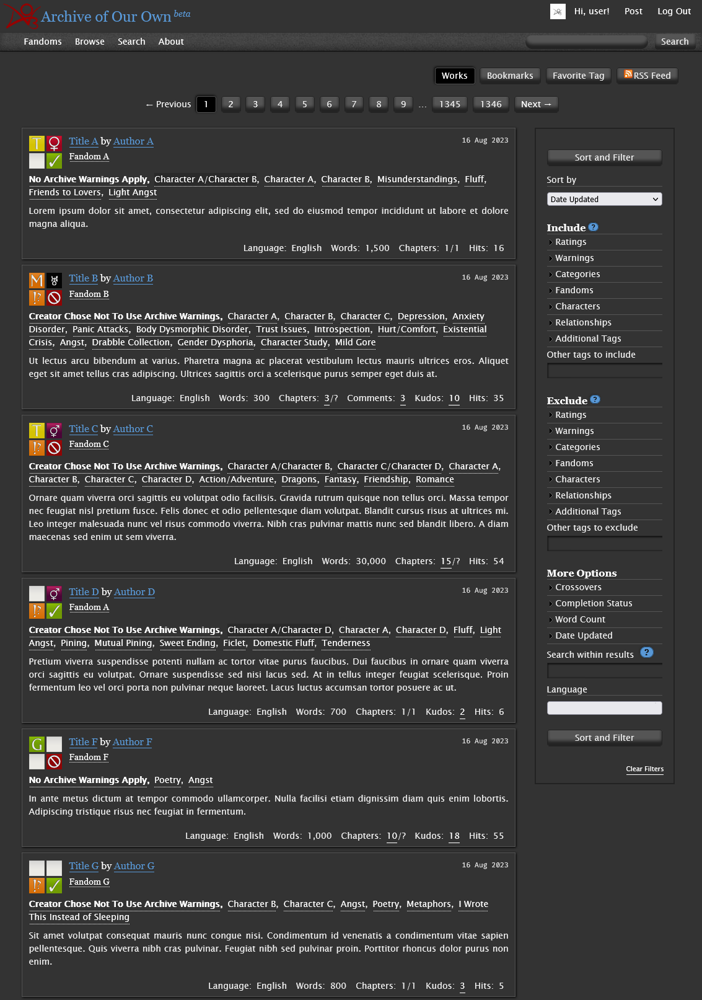 | 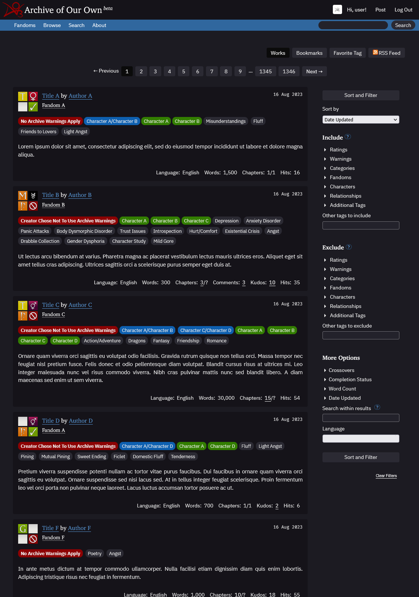 |


### 1.2  Colour-coded tags that ✨pop✨
Tags are essential when trying to find stories you want to read, but they’re often lost in the noise.

With ReversiPlusPlus, tags are colour-coded by category!
- **Red:** content warnings
- **Blue:** relationships
- **Green:** characters
- **Grey:** freeform tags

In the case of tag-heavy works, tags are also confined to a scroll box!
- Tags are confined to ~4 lines per work blurb
- If the number of tags exceeds ~4 lines in a particular blurb, the overflow will be trapped in scroll box jail

|                 Ao3                  |               Reversi                |                  Reversi++                   |
| :----------------------------------: | :----------------------------------: | :------------------------------------------: |
| 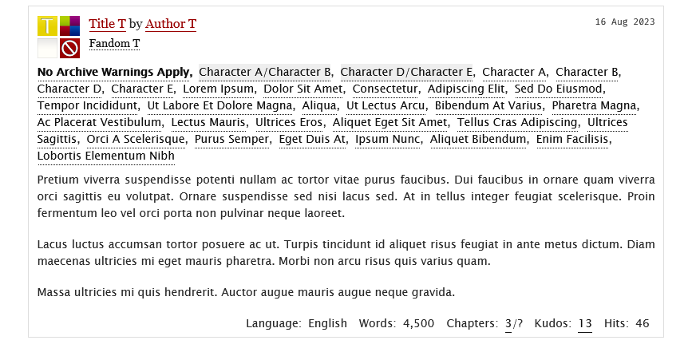 | 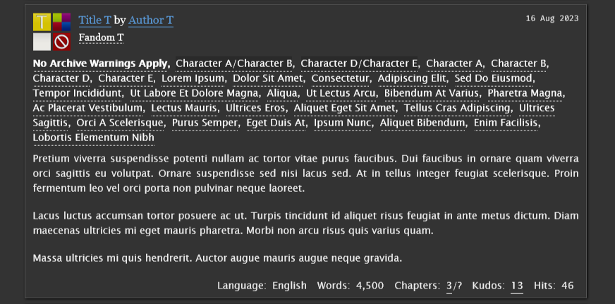 | 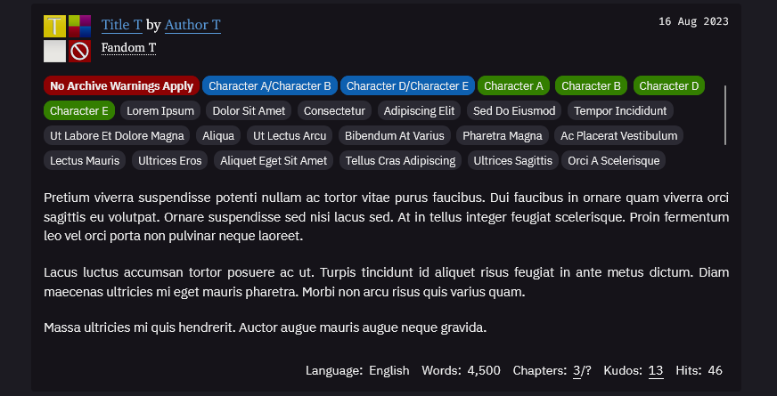 |


### 1.3  Custom fonts
- **Good news:** ReversiPlusPlus uses some common web-safe and system font alternatives in addition to Ao3’s default fonts!

- **Bad news:** Due to how Ao3 handles user skins and limits CSS, they can’t be automatically packaged with or built into the skin.

This means if you want alternative fonts to appear, you’ll have to **install them on your device** — PC, phone, tablet, or whatever else.

For your convenience, here is a handy table containing (most) of the fonts and where to find them.

| Serif                                                                                         |               | Sans-Serif                                                                     |               | Monospaced                                                                           |               |
| :-------------------------------------------------------------------------------------------- | :-----------: | :----------------------------------------------------------------------------- | :-----------: | :----------------------------------------------------------------------------------- | :-----------: |
| [Charter](https://fontesk.com/charter-typeface/)                                              | ```* @    ``` | [Helvetica Neue](https://myfonts.com/collections/neue-helvetica-font-linotype) | ```  @   $``` | [Fira Code](https://fonts.google.com/specimen/Fira+Code)                             | ```*      ``` |
| [IBM Plex Serif](https://fonts.google.com/specimen/IBM+Plex+Serif)                            | ```*      ``` | [IBM Plex Sans](https://fonts.google.com/specimen/IBM+Plex+Sans)               | ```*      ``` | [IBM Plex Mono](https://fonts.google.com/specimen/IBM+Plex+Mono)                     | ```*      ``` |
| [Libre Baskerville](https://fonts.google.com/specimen/Libre+Baskerville)                      | ```*      ``` | [Lato](https://fonts.google.com/specimen/Lato)                                 | ```*      ``` | [Menlo](https://github.com/hbin/top-programming-fonts/blob/master/Menlo-Regular.ttf) | ```* @    ``` |
| [Literata](https://fonts.google.com/specimen/Literata)                                        | ```*      ``` | [Noto Sans](https://fonts.google.com/specimen/Noto+Sans)                       | ```*      ``` | [Source Code Pro](https://fonts.google.com/specimen/Source+Code+Pro)                 | ```*      ``` |
| [Lora](https://fonts.google.com/specimen/Lora)                                                | ```*      ``` | [Proxima Nova](https://fonts.adobe.com/fonts/proxima-nova)                     | ```  @   $``` |                                                                                      |               |
| [Noto Serif](https://fonts.google.com/specimen/Noto+Serif)                                    | ```*      ``` | [Source Sans 3](https://fonts.google.com/specimen/Source+Sans+3)               | ```*      ``` |                                                                                      |               |
| [Palatino](https://myfonts.com/collections/palatino-font-linotype)                            | ```  @   $``` |                                                                                |               |                                                                                      |               |
| [Palatino Linotype](https://learn.microsoft.com/en-us/typography/font-list/palatino-linotype) | ```    #  ``` |                                                                                |               |                                                                                      |               |
| [Source Serif 4](https://fonts.google.com/specimen/Source+Serif+4)                            | ```*      ``` |                                                                                |               |                                                                                      |               |

```*``` − Web font (i.e., free!)  
```@``` − iOS/iPadOS system font  
```#``` − Mircrosoft Office cloud/Windows system font  
```$``` − Paid


## 2  Installation

### 2.1 Create a site skin
ReversiPlusPlus builds right off of Ao3’s existing stylesheet, so no extra add-ons or browser extensions required!

Installing is as simple as creating a new site skin for your user. All user site skins are private by default — no worries about accidentally making something public.

To create a new site skin:

1. Navigate to [Archive Of Our Own](https://archiveofourown.org/).

2. While logged in, go to your dashboard.

	

3. On the dashboard, select ```Skins```.

	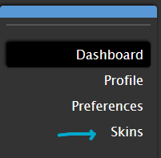

4. The Skins page will have multiple buttons. In the top right-hand corner, select ```Create Site Skin```.

	
	
	Welcome to the Create New Site Skin page!
	
	

5. Fill in the following fields:

	1. The ```Type``` field must be set to ```Site Skin```.
	2. The ```Title``` field must have a value in it, and that value **must be unique** because Ao3 only distinguishes user site skins by name, not by user.
	3. The ```CSS``` field must have CSS in it — i.e., the text in [```reversiplusplus.css```](https://github.com/galaxygrotesque/ReversiPlusPlus/blob/main/css/ReversiPlusPlus.css) or [```reversiplusplus_mobile.css```](https://github.com/galaxygrotesque/ReversiPlusPlus/blob/main/css/ReversiPlusPlus-Mobile.css).

	**Don’t submit just yet!**
	
	Need a couple extra things first — namely, the options hidden under this fun little ```Show ↓``` button under the giant CSS field.
	
	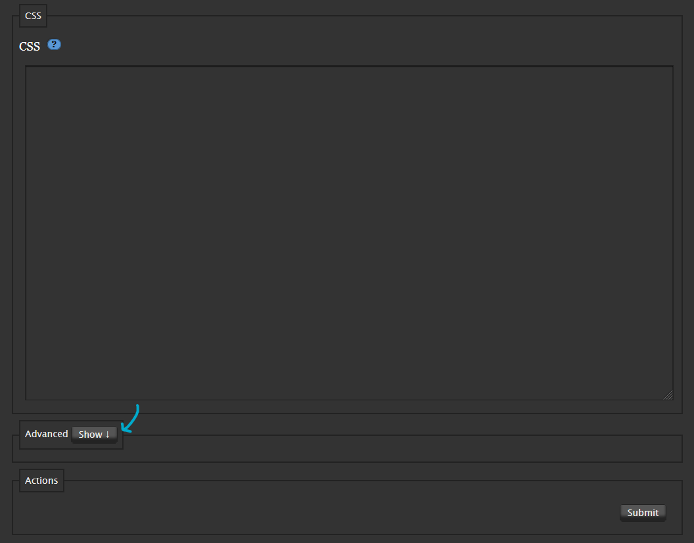
	
	You’ll get a section that looks like this:
	
	
	
6. Here, fill in the following fields:
	
	1. The ```What it does``` field must be set to ```add on to archive skin```.
	2. In the ```Media``` section under ```Choose @media```, the ```⬜ all``` option must be checked.

	All done?

7. Hit ```Submit```!

	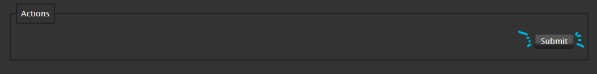

8. You’ll be taken to a new page with your site skin with a ```Skin was successfully created.``` message.

	Scroll aaaaall the way down to the bottom where you’ll see these four options:

	
	
	Hit ```Use```.

And voilà! There you have it. Skin installed. 🌠

### 2.2 Changing fonts
ReversiPlusPlus offers different default fonts than Ao3. Should you want to change them, you will need to edit [```reversiplusplus.css```](https://github.com/galaxygrotesque/ReversiPlusPlus/blob/main/css/ReversiPlusPlus.css) or [```reversiplusplus_mobile.css```](https://github.com/galaxygrotesque/ReversiPlusPlus/blob/main/css/ReversiPlusPlus-Mobile.css) to include more or less of the fonts listed above (or others you may have installed on your machine).

There are four separate places to define fonts, each marked by ```/* font choices go here ↓ */``` for easy searching.

1. Body fonts

       body {		/* font choices go here ↓ */
	     font-family: "IBM Plex Sans", "Proxima Nova", "Helvetica Neue", "Lucida Grande", "Lucida Sans Unicode", "GNU Unifont", Verdana, Helvetica, sans-serif;
	   }
	   
	   …
	   
	   input,
       textarea,
       blockquote,
       blockquote.userstuff,
       .blurb blockquote,
       .dropdown,
       .expander,
       .toggled form {	/* font choices go here ↓ */
	     font-family: "IBM Plex Sans", "Proxima Nova", "Helvetica Neue", "Lucida Grande", "Lucida Sans Unicode", "GNU Unifont", Verdana, Helvetica, sans-serif;
       }

2. Header fonts

       h1,
       h2,
       h3,
       h4,
       h5,
       h6,
       .heading,
       .bookmark .user .meta {	/* font choices go here ↓ */
         font-family: "Charter", "IBM Plex Serif", "Palatino", "Georgia", serif;
       }

3. Mono fonts

       kbd,
       tt,
       code,
       var,
       pre,
       samp {		/* font choices go here ↓ */
	     font-family: "Fira Code", "Source Code Pro", "Menlo", "Monaco", "Consolas", Courier, monospace;
	     …
       }

3. Work fonts

       #chapters .userstuff a,
       #chapters .userstuff p,
       #chapters .userstuff ol,
       #chapters .userstuff ul {	/* font choices go here ↓ */
   	     font-family: "Charter", "IBM Plex Serif", "Palatino Linotype", "Palatino", "Literata", "Georgia", serif;
	     …
       }

The ```font-family``` value determines what font displays on a device. If the first font choice in the ```font-family``` list isn’t available, the next choice will be used, eventually falling back to the device’s default font (designated ```sans-serif```, ```serif```, or ```monospace```). This means if you have multiple devices with different fonts, you can include them in the list and the appropriate one will display.

> [!NOTE]  
> When editing the font list, make sure the chosen font name is spelled correctly, enclosed in straight quotes (```""```), and followed by a comma (```,```) if another value follows it like the example below.

    font-family: "Font Choice 1", "Font Choice 2", "Font Choice 3", serif;


## 3  Road map
- [x] Mobile-specific ```reversiplusplus.css```
	- [ ] Refine ```reversiplusplus_mobile.css```
- [ ] Vet and add support for more fonts
- [ ] Tidy code (read: figure out what I’m doing)
- [ ] Rewrite as fully-fledged stylesheet to replace rather than build off of Ao3’s core

### 3.1  Short-term to-do list
- [ ] Adjust sort and filter sidebar to match work index group
- [x] Figure out how to lower buttons/stats on work blurbs
- [x] Add more fonts into font lists
- [ ] Get rid of borders everywhere except for explicit elements
- [ ] Different unicode arrow characters for mobile because apparently Roboto doesn’t like it
- [x] Start setting up mobile values so creation of ```reversiplusplus_mobile.css``` is easier

## 4 Credits & acknowledgements
- Reversi base: [archiveofourown](https://archiveofourown.org/skins/929)  
- Tag scroll box:	[archiveofourown](https://archiveofourown.org/skins/3756)  
- Tag bubbles: [@nyxmidnight](https://github.com/nyxmidnight)’s [ao3tagsfonts](https://github.com/nyxmidnight/ao3tagsfonts)  
- Typography: [mb](https://practicaltypography.com/index.html)
