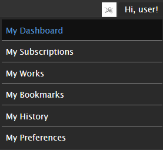

# ReversiPlusPlus
[Reversi](https://archiveofourown.org/skins/929)—but better. An Archive of Our Own “dark mode” reskin with a focus on readability and less noise.

**This project is a work-in-progress.** Please bear with me while I find my stylesheet legs.


## Features
**TL;DR:**
- [Darker colours!](https://github.com/galaxygrotesque/ReversiPlusPlus#dark-mode-redux)
- [Colourfully obvious tags trapped in a scroll box!](https://github.com/galaxygrotesque/ReversiPlusPlus#colour-coded-tags-that-pop)
- [Dope fonts (if you’re willing to install them)!](https://github.com/galaxygrotesque/ReversiPlusPlus#custom-fonts)


### Dark mode redux
If you:
- hate reading on a stark white background
- hate reading on a *light* background
- prefer OLED themes or find some dark themes too bright
- have tired and/or light-sensitive eyes that suffer every time you step outside your carefully curated ~~cave~~ corner of the internet

Then ReversiPlusPlus might be your cup of tea!

Inspired by Mozilla Firefox’s dark colour scheme, ReversiPlusPlus:
- Uses a darker colour palette that is easier on the eye
- Reduces visual noise by relying on colour/element contrast rather than borders and lines

|              Vanilla Reversi              |              ReversiPlusPlus               |
| :---------------------------------------: | :----------------------------------------: |
|  |  |


### Colour-coded tags that ✨pop✨
Tags are essential when trying to find stories you want to read, but they’re often lost in the noise.

With ReversiPlusPlus, tags are colour-coded by category!
- **Red:** content warnings
- **Blue:** relationships
- **Green:** characters
- **Grey:** freeform tags

In the case of tag-heavy works, tags are also confined to a scroll box!
- Tags are confined to ~4 lines per work blurb
- If the number of tags exceeds ~4 lines in a particular blurb, the overflow will be trapped in a scroll box

|           Vanilla Reversi Tags           |           ReversiPlusPlus Tags            |
| :--------------------------------------: | :---------------------------------------: |
|  |  |


### Custom fonts
- **Good news:** ReversiPlusPlus uses some common web-safe font alternatives in addition to Ao3’s default fonts!

- **Bad news:** Due to how Ao3 handles user skins and limits CSS, they can’t be automatically packaged with the skin. (I went through a grieving process here. Trust me, I really wish they could.)

This means **if you want alternative fonts** to appear, you’ll have to **install them on your device**—PC, phone, tablet, or whatever else.

<!-- - [How do I install a font?]() -->

For your convenience, here is a handy table containing (most) of the fonts and where to find them.

| Font                                                                                 | Availability |
| :----------------------------------------------------------------------------------- | :----------- |
| [Charter](https://fontesk.com/charter-typeface/)                                     | \* @         |
| [Fira Code](https://fonts.google.com/specimen/Fira+Code)                             | \*           |
| [Helvetica Neue](https://www.myfonts.com/collections/neue-helvetica-font-linotype)   | @ $          |
| [IBM Plex Sans](https://fonts.google.com/specimen/IBM+Plex+Sans)                     | \*           |
| [IBM Plex Serif](https://fonts.google.com/specimen/IBM+Plex+Serif)                   | \*           |
| [Literata](https://fonts.google.com/specimen/Literata)                               | \*           |
| [Menlo](https://github.com/hbin/top-programming-fonts/blob/master/Menlo-Regular.ttf) | \* @         |
| [Noto Sans](https://fonts.google.com/specimen/Noto+Sans)                             | \*           |
| [Palatino](https://www.myfonts.com/collections/palatino-font-linotype)               | @ $          |
| [Proxima Nova](https://fonts.adobe.com/fonts/proxima-nova)                           | @ $          |
| [Source Code Pro](https://fonts.google.com/specimen/Source+Code+Pro)                 | \*           |
| [Source Sans 3](https://fonts.google.com/specimen/Source+Sans+3)                     | \*           |
| [Source Serif 4](https://fonts.google.com/specimen/Source+Serif+4)                   | \*           |

\* — web font (or free!)  
@ — i(Pad)OS system font  
$ — paid (not free ... unless system font)


## Screenshots
[To add]


## Road map
- [ ] Mobile-specific .CSS
- [ ] More fonts
	- [ ] web
	- [ ] system (win)
	- [ ] system (iOS)
- [ ] Tidy code (and figure out what I’m doing)
- [ ] Rewrite as fully-fledged stylesheet to replace rather than build off of Ao3’s core


## Installation
ReversiPlusPlus builds right off of Ao3’s existing stylesheet, so no extra add-ons or browser extensions required!

Installing is as simple as **creating a new site skin** for your user. All user site skins are private by default—no worries about accidentally making something public.

To create a new site skin:

1. Navigate to [Archive Of Our Own](https://archiveofourown.org/).

2. While logged in, go to your dashboard.

	

3. On the dashboard, select “**Skins**”.

	

4. The Skins page will have multiple buttons. In the top right-hand corner, select ”**Create Site Skin**”.

	

5. Welcome to the Create New Site Skin page!
	
	

	Fill in the following fields:

	1. The **Type** field must be set to “**Site Skin**”.
	2. The **Title** field must have a value in it, and that value must be unique because Ao3 only distinguishes user site skins by name, not by user.
	3. The **CSS** field must have CSS in it—i.e., the text in [```ReversiPlusPlus.css```](https://github.com/galaxygrotesque/ReversiPlusPlus/blob/main/css/ReversiPlusPlus.css). Copy + paste baybeeee ✨

	**Don’t submit just yet!**
	
	Need a couple extra things first—namely, the options hidden under this fun little “**Show ↓**” button guy under the giant CSS field.
	
	
	
	You’ll get a section that looks like this:
	
	
	
	Here, fill in the following fields:
	
	4. The **What it does** field must be set to “**add on to archive skin**”.
	5. In the **Media** section, the “⬜ **all**” option must be checked.

	All done?

6. Slap **Submit**!

	

7. You’ll be taken to a new page with your site skin with a “**Skin was successfully created**” message.

	Scroll aaaaall the way down to the bottom where you’ll see these four options:

	
	
	Hit **Use**.

And voilà! There you have it. Skin installed. 🌠
